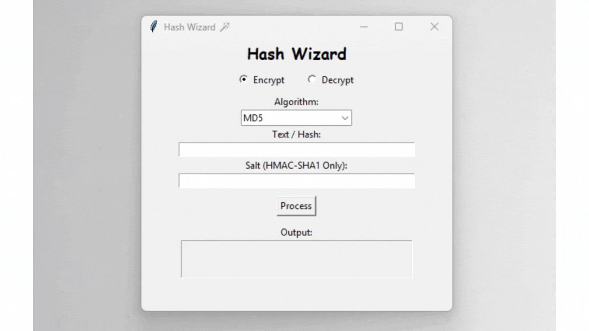
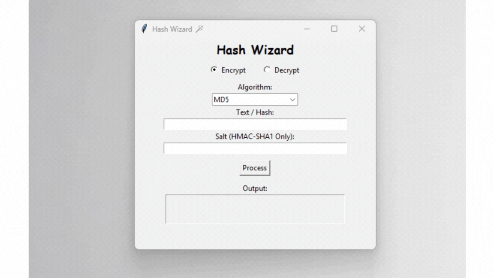
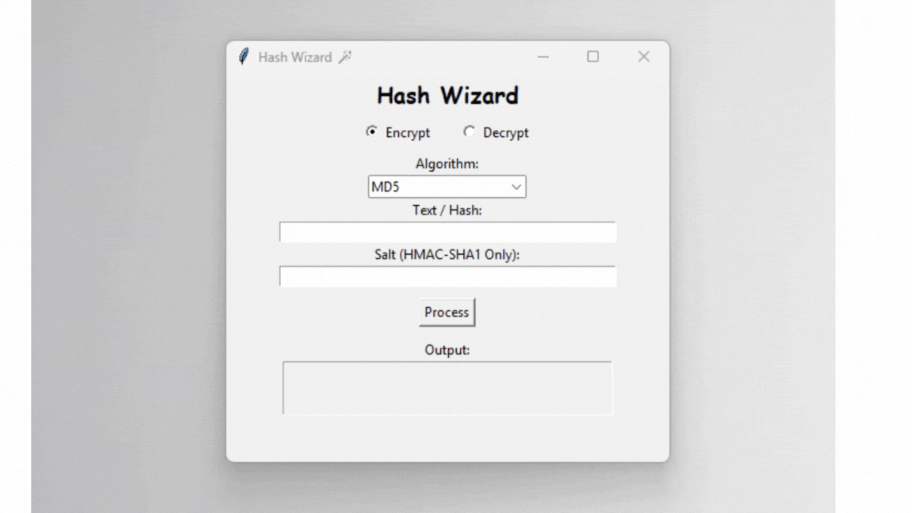
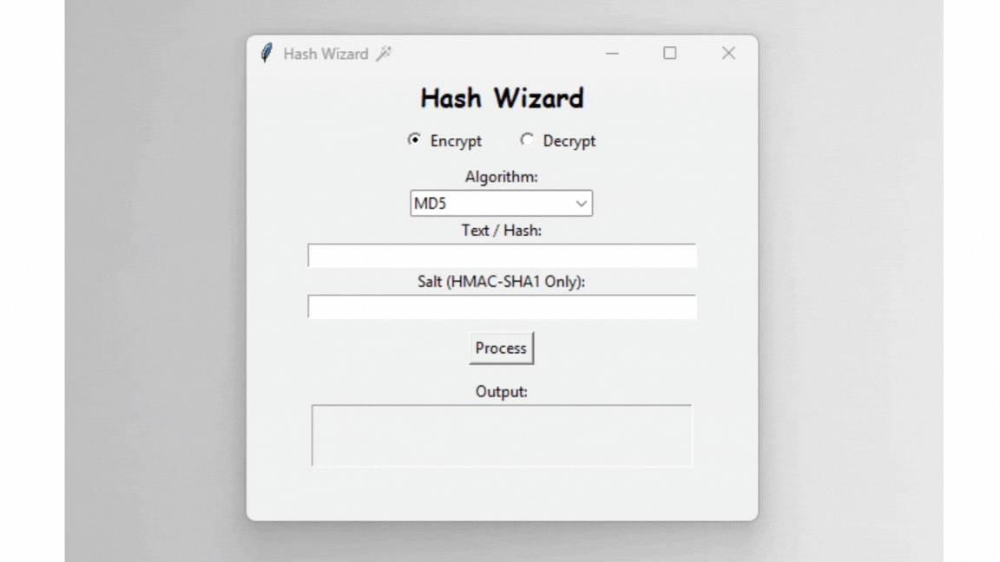
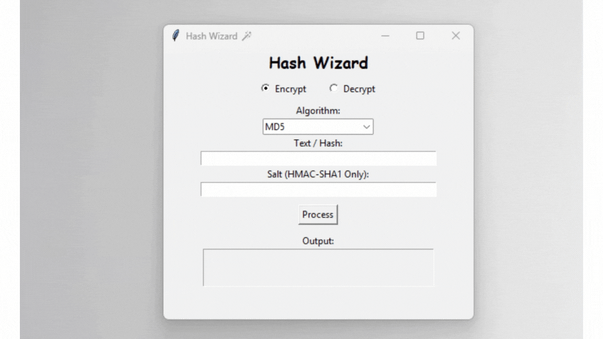

# HashWizardProject

## About the app
This desktop application was developed for educational purposes to explore hash encryption and decryption in various modes, including MD5, SHA1, SHA2_224, SHA2_256, SHA2_512, and HMAC-SHA1. It utilizes the `hashlib` and `hmac` libraries for hash encryption, and `hmac` for encryption with salting. A graphical user interface (GUI) is provided using `tkinter` for enhanced user experience.

## How to use and what you need
* The **`requirements.txt`** file specifies the primary libraries used in the project:
    * **tkinter**: Used for creating the GUI.
    * **hmac**: Provides hash encryption functionality and is included in the standard Python library.
    * **hashlib**: Offers hash and secret key encryption and is also part of the standard Python library.

* To run the application, please follow these steps:
    * **Follow the tutorial**: Refer to the `tutorial.txt` file for detailed instructions.

## Basic usage
1. Create a Python virtual environment.
2. Activate the virtual environment.
3. Install the required libraries using **`pip install -r requirements.txt`**.
4. Launch the desktop application by executing the command **`python main.py`**.
5. To close the application, either click the close button in the top-right corner or press **`Ctrl + C`**.

## Introduction to the website
The application focuses on hash encryption and decryption in various modes, including MD5, SHA1, SHA2_224, SHA2_256, SHA2_512, and HMAC-SHA1. In encryption mode, users can experiment with generating hashes in different algorithms. In decryption mode, users can attempt to convert hashes back into words using a wordlist provided in the `wordlist/hash.txt` file.

## Website details
If "Encryption" mode and "MD5" algorithm are selected, and text is entered, clicking "Process" will display the corresponding MD5 hash in the output field.

If "Decryption" mode and "MD5" algorithm are selected, and a hash is entered, clicking "Process" will display the corresponding word (if found) in the output field.

HMAC-SHA1 Encryption with Salt Example

HMAC-SHA1 Decryption with Salt Example

If in Decryption mode and a hash not found in the wordlist is entered, the following message will be displayed.

### Postscript
This project serves as an educational endeavor to explore the functionalities of hash encryption and decryption. It is also intended as a practical exercise for learning basic library usage related to encryption and decryption. This project is not intended for any illegal or malicious purposes. Finally, thank you to everyone who has taken the time to view my project. Any suggestions or feedback are welcome. Thank you.
